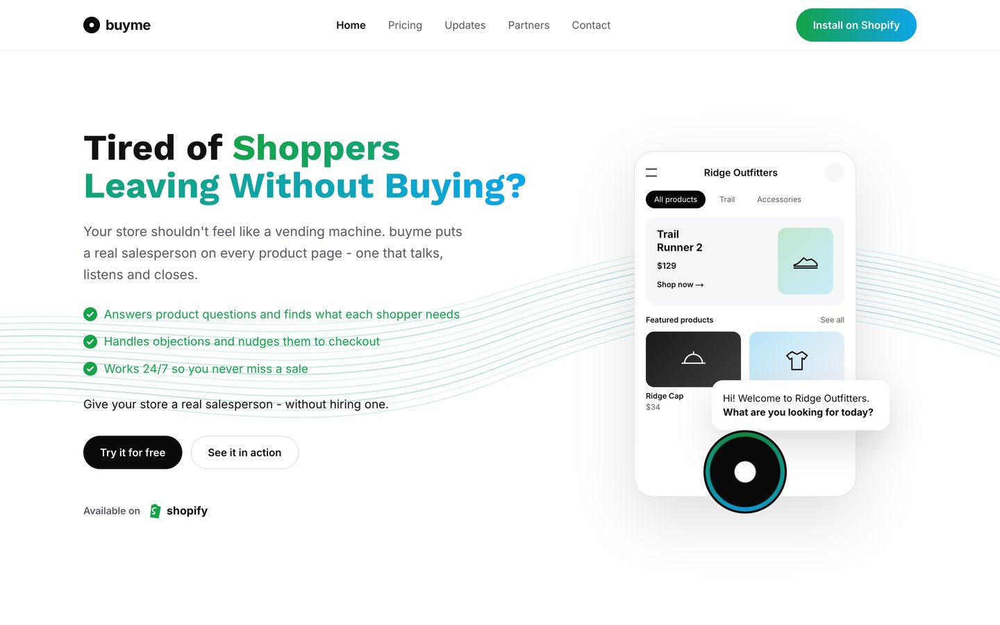
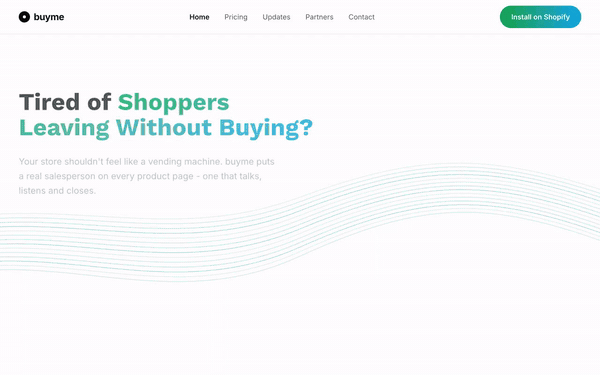
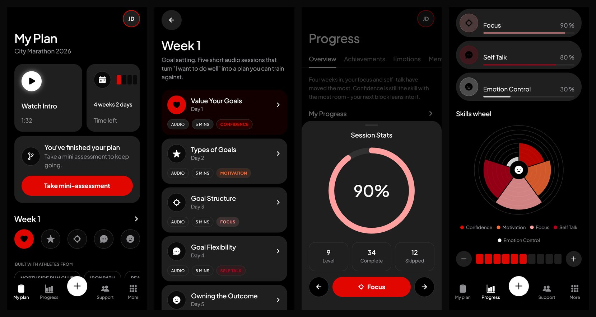
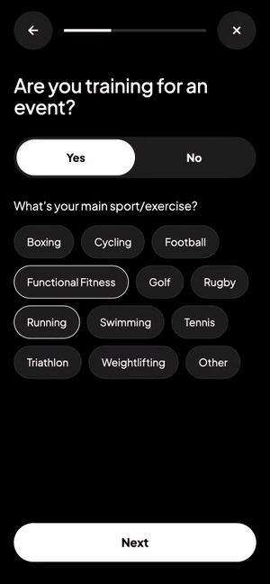

# designiceui

Claude Code skills that turn one prompt into a website or a mobile app by matching it
to a real design in a library, instead of inventing a layout from scratch.

Most AI-built sites look the same because the model designs from nothing: a safe
palette, a safe layout, eleven centred slabs. designiceui replaces invention with
retrieval. Your prompt is matched against `docs/designs/` by vector search, the closest
design becomes the template, and the result is a standalone Next.js or Expo project with
that design's layout, components and section order - re-skinned with your brand.

- **`/design`** - pick the closest real product UI, reproduce its layout and components,
  swap in your colours and fonts. Outputs Next.js (web) or Expo / React Native (mobile).
  Every build ends with an automatic critique pass.
- **`/createui`** - match an art-direction reference and design from it. Next.js only.

## Install

```bash
npx designiceui
```

One command, reversible with `npx designiceui --uninstall`, re-run to update. It clones
the repo into `~/.designiceui` and installs:

| | |
|---|---|
| Skills | `properui` (`/design`), `createui`, `design-library`, `higgsfield-imagery` → `~/.claude/skills/` |
| Commands | `/design`, `/createui`, `/design-search`, `/design-add` → `~/.claude/commands/` |
| Agent | `design-critic`, the critique stage `/design` ends with → `~/.claude/agents/` |
| CLI | `designice` on your PATH (a symlink - nothing is pip-installed) |
| MCP | the `designice` server, registered at user scope |

Requires git, Python 3.10+ and Node 18+ (Expo builds need Node 20.19.4+). Optional:
Playwright for the critique screenshots -
`python3 -m pip install playwright && python3 -m playwright install chromium`.

Until the package is on npm: `npx github:DavitGadyan/designiceui`. From a clone, to
develop it or keep your own designs in it:

```bash
git clone https://github.com/DavitGadyan/designiceui.git && cd designiceui
./scripts/install-skills.sh
```

`/design` shadows Claude Code's built-in Design canvas skill while installed;
`/properui` does the same thing under its own name.

## Examples

Open Claude Code in any folder and type a prompt. Say the company, what it is, the
platform, and optionally colours and fonts.

**A Shopify AI sales agent, web.** Matched the NowUtalk template and re-skinned it green:

```
/design buyme, AI sales agent for Shopify, website with Next.js React, primary #16A34A secondary #0EA5E9
```



Scroll, hover, the FAQ accordion and the closing call to action, recorded from the
finished build:



**A mental-fitness app for athletes, mobile.** Matched the Getahead template; the phone
layout is derived from its desktop capture:

```
/design JustDo, mental fitness app for athletes, mobile app React Native, primary #E10600 secondary #FF6B35, Plus Jakarta Sans
```



Onboarding with draggable rating sliders, the plan and its calendar sheet, a week of
sessions, the session-stats sheet and the skills wheel:



Both builds went through one critique pass before these captures. The `design-critic`
agent put each next to its template and returned twelve findings apiece - a storefront
mockup that was still a wireframe, section heads at 0.7x the reference scale, a FAQ
with the wrong anatomy, session cards that had lost their fill to a style-merging
`Link`, a stats ring that ignored its value, a calendar sheet and a skills wheel that
were missing altogether - and the builder applied them. The reports it wrote are in
[buyme-critique.md](docs/showcase/buyme-critique.md) and
[justdo-critique.md](docs/showcase/justdo-critique.md).

More prompts that work:

```
/design Acme Ledger, invoicing for freelancers, website with Next.js React, primary #0F766E secondary #F59E0B
/design Nova Health, telehealth for patients, mobile app React Native, navy #1E3A8A and coral #F97316
/design Chrono Atelier, luxury watch shop, website with Next.js React, primary #8B1E2D
/createui a dark scroll-driven landing page for a space startup
/design-search luxury watch shop          # see what would match, and why - no build
```

Plain language works too: *"make me a React Native app for a telehealth startup, navy
and coral"* triggers the skill without a slash command. The skill names the template it
picked before building - say so if you want a different one. Projects land in
`<clone>/output/<company>/` (`DESIGNICE_OUTPUT` to change).

## What the skills do

| | Does | Say |
|---|---|---|
| `properui` (`/design`) | Matches your product to the closest real UI with screenshots, reproduces its components and layout, re-skins it with your brand. Web or mobile. | "/design ...", "like our existing UI but for ...", "React Native app for ...", "use our brand colours" |
| `createui` | Matches an art-direction reference (palette, type, motion) and designs a Next.js site from the brief. | "/createui ...", "build me a landing page", "make a site for X" |
| `design-library` | Adds designs to the library: writes the description that makes them findable, tags them, generates `meta.json`, reindexes. | "add this design", "tag this", "reindex", a bad match |
| `higgsfield-imagery` | Art-directed hero, texture, section and OG images in the design's palette. Returns the prompts if there is no API key. | "generate a hero image", "I need photography for this" |
| `design-critic` (agent) | The last stage of `/design`. Compares the finished build with the template screenshots for fine-grained UI/UX drift and returns a fix list. Ignores colours and fonts. Read-only. | runs automatically; or "critique this build", "what drifted from the template?" |

How a `/design` build runs:

1. **Match** - `designice search --require-media` over the library. The skill says
   which template it picked and why.
2. **Look** - it reads every screenshot of the template and notes the section order,
   layout and component shapes.
3. **Scaffold** - `designice scaffold` writes a Next.js or Expo project with your tokens
   wired, one stub component per section, `LAYOUT.md` (the region-by-region contract)
   and `DESIGN.md` (a "template → yours" table of exactly what changed).
4. **Implement** - each section from its screenshot: same components, same order, same
   proportions - only tokens differ. Real copy for your company.
5. **Verify** - clean build, 375px width, keyboard focus, reduced motion (web);
   typecheck and `expo export` (mobile).
6. **Critique** - the `design-critic` agent screenshots the build at desktop and phone
   width (`designice snapshot`), compares it region by region with the template, and
   writes `verify/CRITIQUE.md`: a fidelity table plus Must fix / Should fix / Polish
   findings, each with the concrete change. The builder applies them and re-runs it once.

Brand overrides map onto roles: `primary → accent` (CTAs, links, focus), `secondary →
accent2` (tags, secondary buttons). Neutrals only change if you name `--ground` or
`--ink`. If you give no colours the template's stay - and the brief flags every one of
them, because a re-skin still wearing the template's brand colour is not finished.

## Run what it built

Web (Next.js 15, App Router, Tailwind v4, `output: "standalone"`):

```bash
cd output/buyme
npm install
npm run dev                                          # http://localhost:3000
npm run build && node .next/standalone/server.js     # deployable without node_modules
```

Mobile (Expo SDK 57, Expo Router):

```bash
cd output/justdo
npm install && npx expo install --fix
npx expo start                                       # Expo Go, or i / a for a simulator
npx tsc --noEmit && npx expo export --platform ios
```

Inside a project: `app/globals.css` or `lib/theme.ts` (every token), one component per
section under `components/sections/` or `components/blocks/`, `design-reference/` (the
template screenshots), `LAYOUT.md`, `DESIGN.md`, and after a `/design` build
`verify/CRITIQUE.md`.

## The library

```
docs/designs/
  Wealthcore/
    hero.png              screenshots (or video)
    description.txt       plain English - this is what gets embedded
    meta.json             optional: tags, palette, fonts
```

Drop a folder in and it is searchable on the next query - no reindex, no reinstall.
Write `description.txt` as if to a colleague who cannot see the screenshot: real hex
codes, real fonts, the technique behind the motion, the one detail that carries the
design. That text is what makes it findable and what makes the generated site specific.
`/design-add "My New Design"` walks through it; `designice new` and `designice annotate`
do the mechanical parts.

Ships with 36 designs: 24 product captures with screenshots (fintech, health,
ecommerce, SaaS, travel, AI, dev tools, agency) and 12 art-direction briefs analysed
from [motionsites.ai](https://motionsites.ai/). Descriptions are original analysis.

**Matching** fuses three signals - dense embedding (0.60, meaning), BM25 (0.25, exact
words like a brand name or "terracotta") and tag overlap (0.15) - plus a scope factor so
a whole-site request is not matched to a single component. Seven tag facets, 111 tags
(`designice tags`); filter with `--filter industry=fintech --filter palette=dark`.
Embeddings: `voyage` if `VOYAGE_API_KEY` is set, else `openai` if `OPENAI_API_KEY`, else
a stdlib TF-IDF backend that needs nothing. Reindex after switching.

## CLI and MCP

Everything the skills do is a `designice` subcommand, so it also works without Claude
Code:

```bash
designice status                                               # library + index health
designice search "ai sales agent for shopify" --require-media -k 5
designice show nowutalk --json                                 # tokens, tags, screenshot paths
designice scaffold "ai sales agent for shopify" --require-media --platform web \
  --company buyme --primary "#16A34A" --secondary "#0EA5E9" \
  --sections nav,hero,agent-features,shopify,install-steps,demo-video,intelligence,faq,cta,footer
designice images --design nowutalk --company buyme --dry-run  # art-directed image prompts
designice snapshot http://localhost:3000 --out verify/critique # per-region screenshots + manifest.json
designice new "Aurora Fintech" && designice annotate "Aurora Fintech"
designice index --backend openai                               # force a rebuild / switch backend
```

From the terminal you get the scaffold; implementing the sections against the
screenshots is what the skill does inside Claude Code.

The same operations are MCP tools (`design_search`, `design_get`, `design_list`,
`design_tags`, `design_brief`, `scaffold_nextjs`, `scaffold_expo`, `higgsfield_generate`,
`library_index`, `library_status`), registered by the installer or by hand:

```bash
claude mcp add designice --scope user -- python3 /absolute/path/to/designiceui/bin/designice-mcp
```

Imagery: set `HF_API_KEY_ID` and `HF_API_KEY_SECRET` from
[cloud.higgsfield.ai](https://cloud.higgsfield.ai/) to generate; without them the
prompts come back as text.

## Development

```bash
PYTHONPATH=src python3.12 -m pytest tests -q     # 64 tests
./scripts/package-skills.sh                      # validate + package skills into release/skills/
./scripts/install-skills.sh                      # reinstall after changing a skill, command or agent
npx designiceui --uninstall
```

Publishing, what travels with the repo and the screenshot-rights checklist:
[PUBLISHING.md](PUBLISHING.md). Library structure, taxonomy and MCP distribution are
modelled on [motionsites.ai](https://motionsites.ai/); image generation uses the
[Higgsfield API](https://docs.higgsfield.ai/docs).
